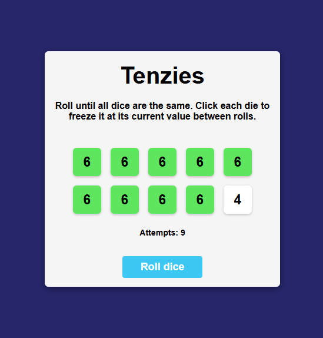

# 🎲 Tenzies Game

Simple and fun dice game built with **React**.  
Your goal is to roll all dice until they are the same. Click each die to "hold" it between rolls.



> 🧠 This project was built based on the [Scrimba React Course](https://scrimba.com/learn/learnreact)  
> with a few improvements such as local storage, accessibility support, and better styling.

## 🧠 Rules

- Roll the dice by clicking the **Roll dice** button
- Click on a die to **hold** its value between rolls
- Try to get all 10 dice to show the same number
- Once all dice are held and show the same value, you win 🎉

## 🛠️ Tech Stack

- React (with hooks)
- LocalStorage (state persistence)
- CSS Flexbox & Grid
- Accessibility features (ARIA labels, keyboard focus)

## ✨ Features

- 🎯 Victory detection
- 🧠 Game state saved in **localStorage**
- 🎉 Confetti animation on win
- ♿ Screen-reader support + keyboard navigation
- 🧪 Clean code structure & modular components

## 🚀 How to run locally

```bash
git clone https://github.com/your-username/tenzies-game.git
cd tenzies-game
npm install
npm run dev
```

## 📷 Screenshot

Make sure to add a file named `game-screenshot.png` to the project root for the image above to show up on GitHub.

## 📄 License

MIT
